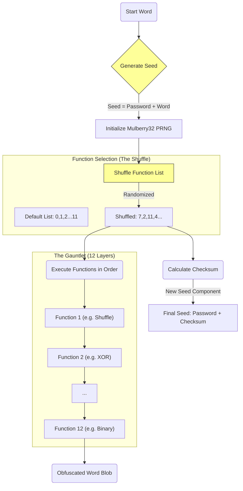
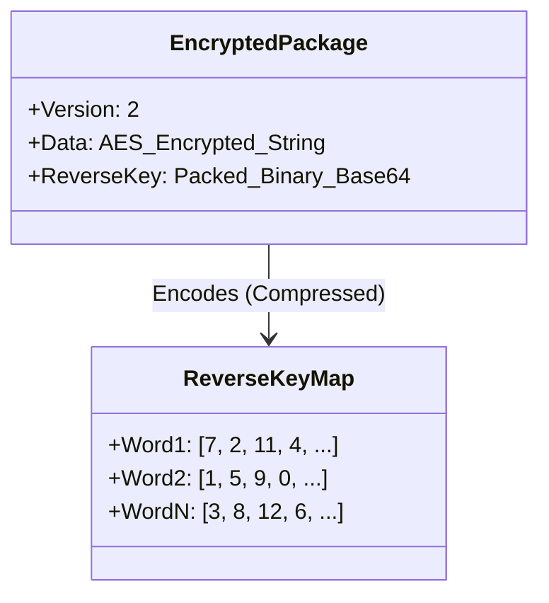
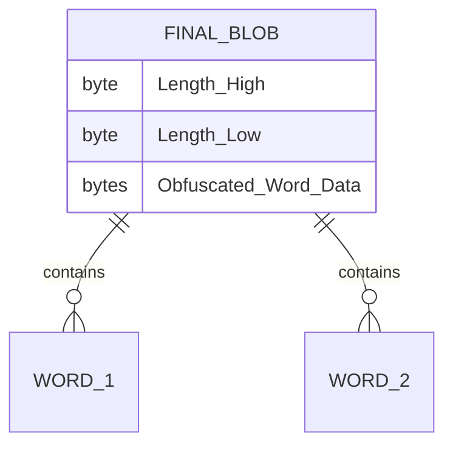
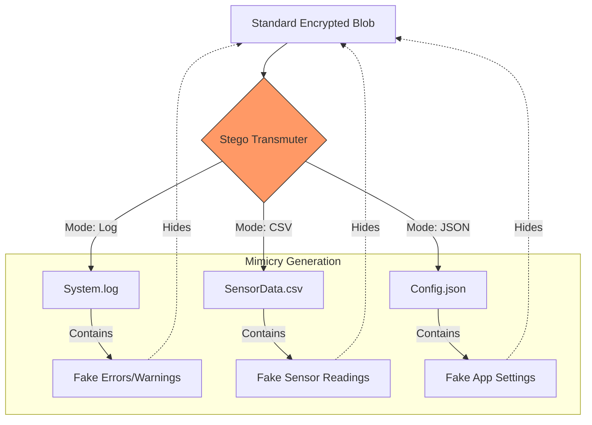
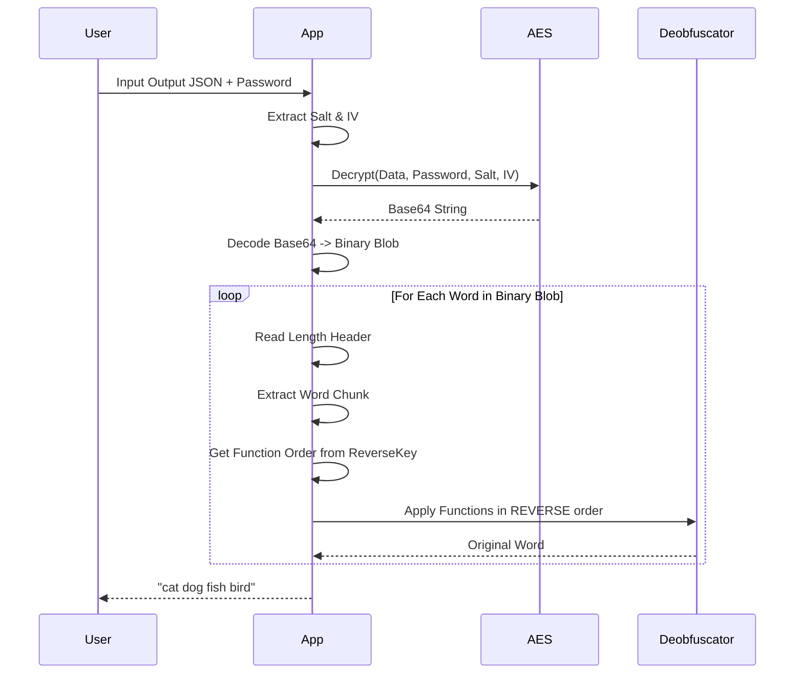

  <picture>
    <source media="(prefers-color-scheme: dark)" srcset="public/assets/img/logo-white.png">
    
  </picture>

  
  
  
  
  
  
  
  
  
  

# Darkstar V2 Encryption Architecture

This document illustrates the internal workings of the Darkstar V2 Encryption System. It combines **Dynamic Structural Obfuscation** with standard **AES-256-CBC** to create a defense-grade security layer for mnemonic phrases.

## 1. High-Level Workflow

The system transforms a readable mnemonic into a secure, opaque JSON blob.

```mermaid
graph LR
    User([User Input]) -->|Mnemonic + Password| Split(Split Words)
    Split -->|Word 1| Pipeline[Dynamic Obfuscation Pipeline]
    Split -->|Word 2| Pipeline
    Split -->|Word N| Pipeline
    
    Pipeline -->|Obfuscated Bytes| Assembler(Blob Assembly)
    Assembler -->|Binary Blob| Base64[Base64 Encoding]
    Base64 -->|Payload| AES[AES-256-CBC Encryption]
    AES -->|Encrypted Data| JSON[Final JSON Output]
    
    style User fill:#f9f,stroke:#333
    style AES fill:#bbf,stroke:#333
    style Pipeline fill:#bfb,stroke:#333
    
    %% Spacing Fixes
    linkStyle default interpolate basis
```

---

## 2. The Core: Dynamic Obfuscation Pipeline

Unlike standard encryption which applies a static algorithm, Darkstar V2 applies a **unique, chaotic sequence of transformations** to every single word. The order of these transformations is determined by the data itself.

### Per-Word Processing Logic

### The "Reverse Key"
Because the functions are shuffled randomly for every word, we must save the **order** in which they were applied to reverse the process tailored to that specific word.

**New in V2.1: Reverse Key Compression**
To improve efficiency, the reverse key (a sequence of integers) is now compressed using binary packing (4 bits per value) instead of plain JSON. This reduces the key size by ~75%.

---

## 3. The 12 Obfuscation Layers

Each word passes through all 12 of these layers. Some are structural (changing the format), some are entropic (increasing noise).

| Type | Function | Visual Effect |
| :--- | :--- | :--- |
| **Structure** | `ObfuscateToBinary` | `A` -> `01000001` |
| **Structure** | `ObfuscateToCharCodes` | `A` -> `65` |
| **Cipher** | `AtbashCipher` | `A` -> `Z` |
| **Cipher** | `CaesarCipher` | `A` -> `N` (ROT13) |
| **Cipher** | `VigenereCipher` | Uses seed to shift values |
| **Chaos** | `Shuffle` | Randomizes byte positions |
| **Chaos** | `Interleave` | Injects random noise characters |
| **Chaos** | `BlockReversal` | Flips chunks of data |
| **Chaos** | `SwapAdjacent` | Swaps neighbors `AB` -> `BA` |
| **Bitwise** | `XOR` | Flips bits using seed |
| **Substitution** | `SeededSubstitution` | Maps bytes to new values |
| **Simple** | `Reverse` | Reverses the entire array |

---

## 4. Final Data Assembly

Once obfuscated, the data isn't just concatenated. It's packed into a structured binary format before encryption.

**Example Binary Structure:**
`[00 05 HELLO] [00 05 WORLD]`

1. **Pack**: All words are packed into this binary stream.
2. **Encode**: The stream is Base64 encoded.
3. **Encrypt**: The Base64 string is encrypted via **AES-256-CBC**.
    - **Key**: Derived from Password + Random Salt (PBKDF2).
    - **IV**: Random 16 bytes.
4. **Output**: `Salt (Hex) + IV (Hex) + Ciphertext (Base64)`

---

## 5. Structural Steganography (Stealth Export)

New in V2.1, this optional layer allows the encrypted blob to be hidden inside common file formats to provide plausible deniability.

**Mechanisms:**
- **Logs**: Payload is split and appended to realistic-looking log lines as "error codes" or "trace IDs".
- **CSV**: Payload is injected into a specific "hash" or "comment" column amidst generated sensor data.
- **JSON**: Payload is distributed across multiple deep fields (e.g., `telemetry.id`, `cache.hash`) in a generated configuration file.

---

## 5. Decryption Flow

Reversing the process requires the `ReverseKey`.

