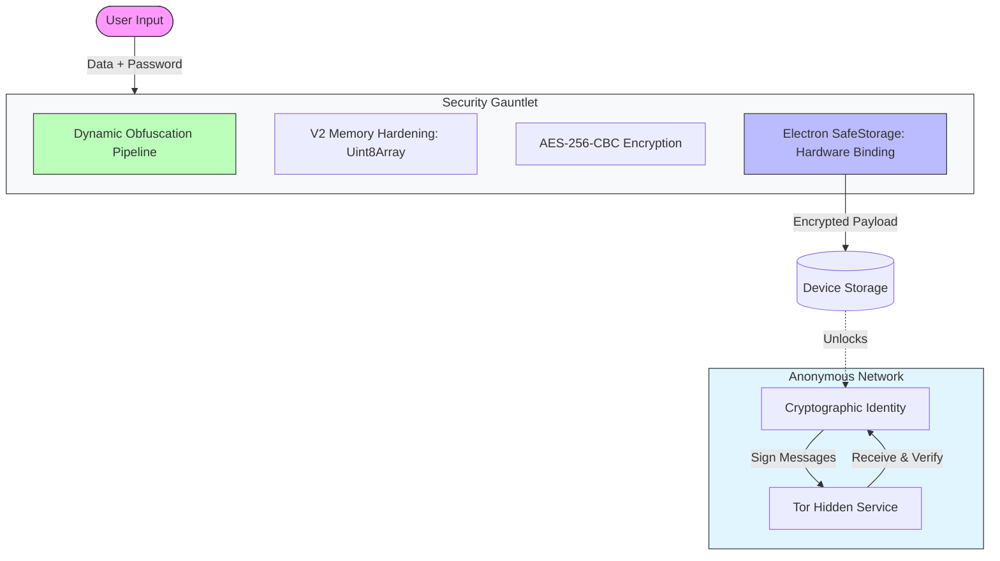
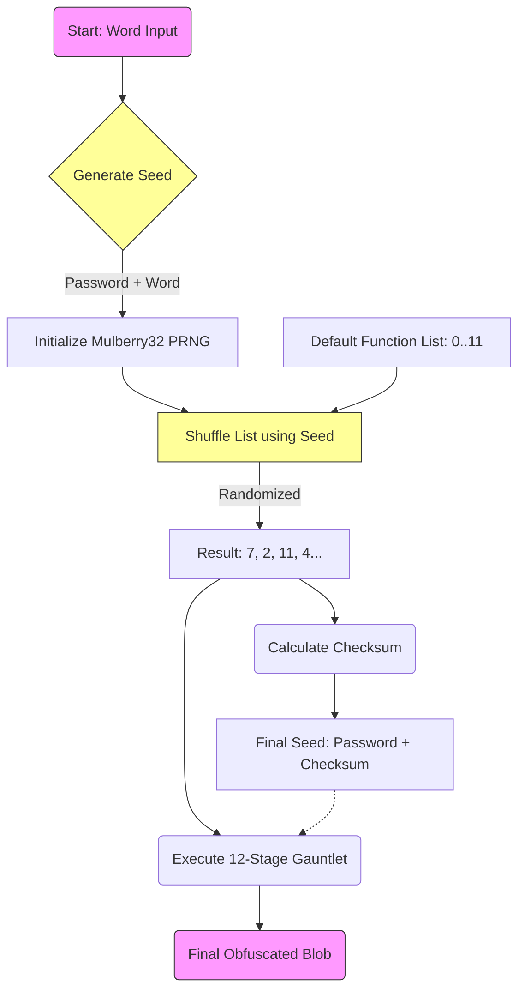
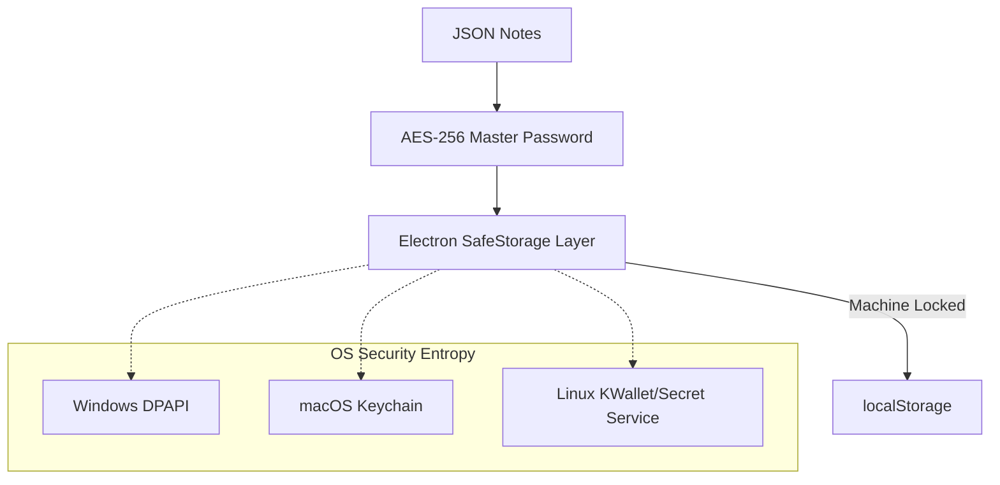
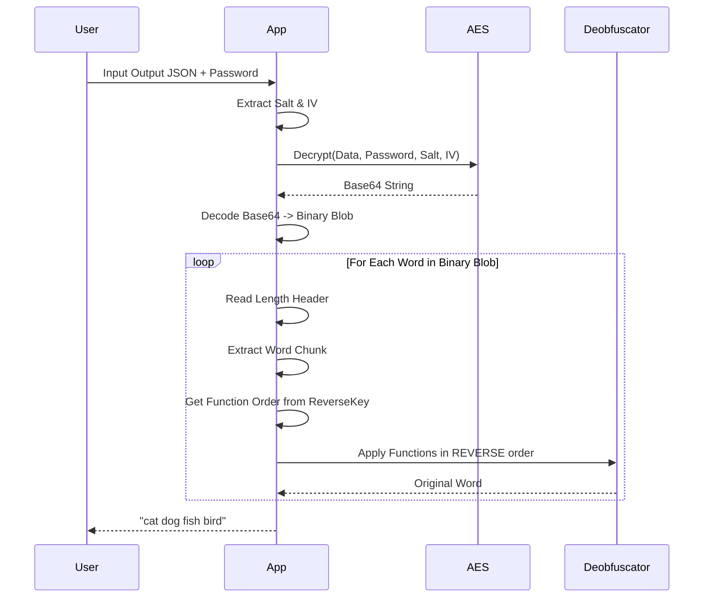
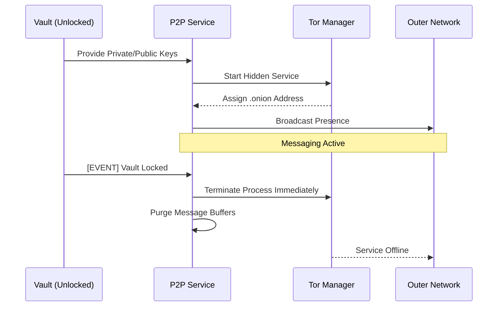

  <picture>
    <source media="(prefers-color-scheme: dark)" srcset="public/assets/img/logo-white.png">
    
  </picture>

  
  
  
  
  
  

  
  
  
  
  

# Darkstar V2 Encryption & P2P Architecture

This document illustrates the internal workings of the Darkstar V2 Security System. It combines **Dynamic Structural Obfuscation**, **AES-256-CBC Encryption**, and a **Decentralized P2P Messaging Network** to create a comprehensive defense-grade security suite.

## 1. High-Level Workflow

The system transforms sensitive data into secure, multi-layered opaque blobs and enables anonymous communication.

---

## 2. The Core: Dynamic Obfuscation Pipeline (Mnemonic Engine)

Unlike standard encryption which applies a static algorithm, the Mnemonic Engine applies a **unique, chaotic sequence of transformations** to every single word.

### Per-Word Processing Logic

### The "Reverse Key"

Because the functions are shuffled randomly for every word, we must save the **order** in which they were applied to reverse the process tailored to that specific word.

**V2.1: Reverse Key Compression**
The reverse key is compressed using binary packing (4 bits per value), reducing the key size by ~75%.

---

## 3. V2 Memory Hardening (Uint8Array)

Darkstar implements a specialized memory hardening strategy to mitigate sensitive data residency in JavaScript's heap.

- **Strict Buffer Usage**: All encryption, decryption, and obfuscation operations now occur on `Uint8Array` rather than `string`.
- **Explicit Zeroing**: Sensitive buffers (passwords, intermediate states) are explicitly filled with zeros (`buffer.fill(0)`) immediately after their useful lifespan.
- **Async Web Crypto**: Leverages the browser's native `SubtleCrypto` for faster and more secure key derivation (PBKDF2) and AES operations.

---

## 4. Hardware-Bound Protection (Electron SafeStorage)

For Secure Vault data, Darkstar utilizes **Electron SafeStorage** to provide a final layer of protection that is bound to the user's host machine.

**Benefits:**

- **Theft Resistance**: Even if the local storage database is stolen, it cannot be decrypted on any other machine or OS user account.
- **Offline Hardening**: Renders massive cracking clusters ineffective unless they have physical access to the device's hardware-backed security entropy.

---

## 5. Secure Vault: Zero-Knowledge Architecture

The Secure Vault is designed so that the application itself has "Zero Knowledge" of the user's secrets between sessions.

- **Session State**: The Master Key and decrypted notes are stored in Angular Signals (volatile memory) and are cleared on page reload or app close.
- **Multi-Factor Persistence**:
  1. **Something You Know**: Master Password (AES-256-CBC).
  2. **Something You Have**: The specific physical machine hardware (SafeStorage).

---

## 6. Structural Steganography (Stealth Export)

This optional layer allows encrypted blobs to be hidden inside common file formats as "noise" or "metadata" to provide plausible deniability. Supported formats include `.log`, `.csv`, and `.json`.

---

## 7. Decryption Flow (Mnemonic)

---

## 8. Anonymous P2P Messaging System

New in V1.8.3, Darkstar introduces a decentralized communication layer built on the Tor network, tightly integrated with the Secure Vault.

### 8.1 Cryptographic Identity Layer
Each vault automatically generates a unique **ECDSA P-256** keypair upon creation or migration.
- **Private Key**: Encrypted within the vault content; never leaves the secure enclave.
- **Public Key**: Exported as a JWK for sharing. Used as the user's cryptographic fingerprint.
- **Purpose**: All outgoing P2P messages are signed with the private key to ensure authenticity and non-repudiation.

### 8.2 Tor Hidden Service Integration
Darkstar bundles a managed Tor process to provide true anonymity.
- **Persistence**: Upon going online, the application creates a Long-Lived Tor Hidden Service.
- **Addressing**: Users are reachable via a unique `.onion` address (e.g., `v2...f4.onion`).
- **End-to-End Encryption**: Communication is encrypted by the Tor protocol and further secured by application-level signatures.

### 8.3 Security Enforcement: The "Vault Lock" Dependency
To prevent identity exposure and ensure message security, the P2P service is reactive to the Vault's state:
1. **Startup Requirement**: The P2P service cannot be started unless the Vault is unlocked.
2. **Emergency Shutdown**: If the Vault is locked (timer, duress, or manual logout), an Angular `effect` triggers an immediate shutdown of the Tor process and clears all messaging buffers from memory.
3. **Signature Verification**: Incoming messages are verified against the sender's public key in real-time using the **Web Crypto API**.

---

## 9. Audio Steganography (WAV LSB)

V1.10 introduces the ability to hide encrypted payloads within audio files using Least Significant Bit (LSB) steganography.

### 9.1 The Process
1.  **Payload Preparation**: The encrypted blob is prefixed with a 32-bit length header.
2.  **Carrier Generation**:
    *   **Custom Cover**: If a user uploads a `.wav` file, its PCM data is used as the carrier.
    *   **White Noise**: If no cover is provided, the system generates random 16-bit PCM noise at -20dB.
3.  **LSB Injection**: The system iterates through the PCM samples, replacing the least significant bit of each 16-bit sample with a bit from the payload.
4.  **Result**: A playable `.wav` file that sounds like the original (or static noise) but contains the hidden data.

---

## 10. Hardware & Biometric Authentication

Darkstar now supports WebAuthn for unlocking the vault, allowing for passwordless entry via:
1.  **Platform Authenticators**: Windows Hello (Face/Fingerprint), TouchID.
2.  **Cross-Platform Authenticators**: YubiKeys, Solokeys (FIDO2/U2F).

**Security Model:**
*   The **Master Password** is not replaced but *wrapped*.
*   When "Registering" biometrics, the Master Password is encrypted using `Electron SafeStorage` (OS-level key).
*   The `SafeStorage` blob is stored locally.
*   **Authentication Flow**:
    1.  User proves presence/identity via WebAuthn (Biometric/YubiKey).
    2.  If successful, the app requests `SafeStorage` to decrypt the stored Master Password blob.
    3.  The decrypted password is then used to unlock the AESVault.
*   **Safety**: This ensures that even if the local storage is dumped, the biometrically protected password cannot be retrieved without the physical device AND the user's biometric authorization.

---

## 11. P2P File Transfer ("DarkDrop") & Reputation

### 11.1 DarkDrop Protocol
Files are too large to send as single JSON payloads over Tor. DarkDrop implements a chunked streaming protocol:
1.  **FILE_START**: Metadata (Name, Size, ID) sent to Receiver. Receiver opens a write stream.
2.  **FILE_CHUNK**: 16KB Base64-encoded chunks sent sequentially.
3.  **FILE_END**: Signals completion. Receiver closes stream.

**Security**:
*   **Path Sanitization**: Filenames are strictly sanitized (`path.basename`) to prevent Directory Traversal attacks.
*   **Consent**: Transfers currently auto-accept from *Trusted* peers (future improvement: manual accept).

### 11.2 Decentralized Reputation (Trust Graph)
A localized "Web of Trust" stored entirely within the encrypted vault.
*   **Trust Score**: 0 (Untrusted) to 100 (Trusted).
*   **Storage**: `VaultTrustNode` objects in the vault JSON.
*   **Visual Indicators**: The UI displays trust badges (Shield icons) based on the local score, helping users distinguish verified contacts from strangers.
