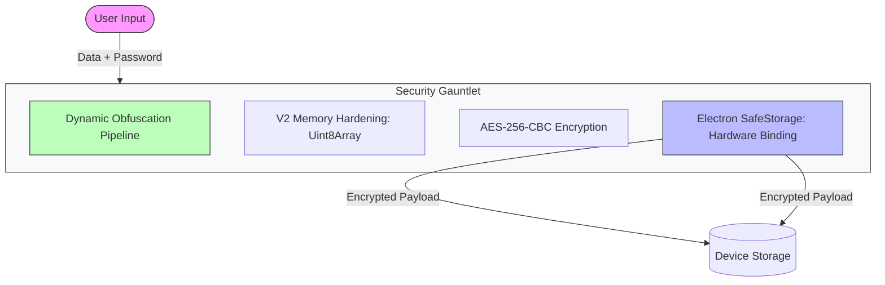
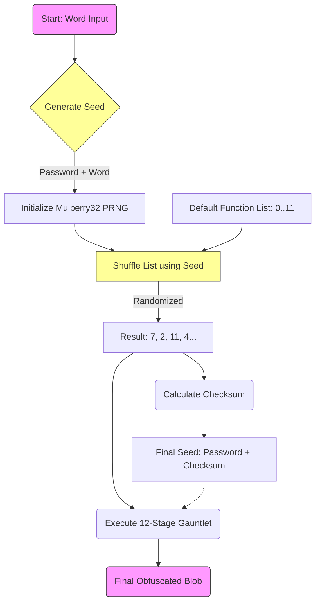
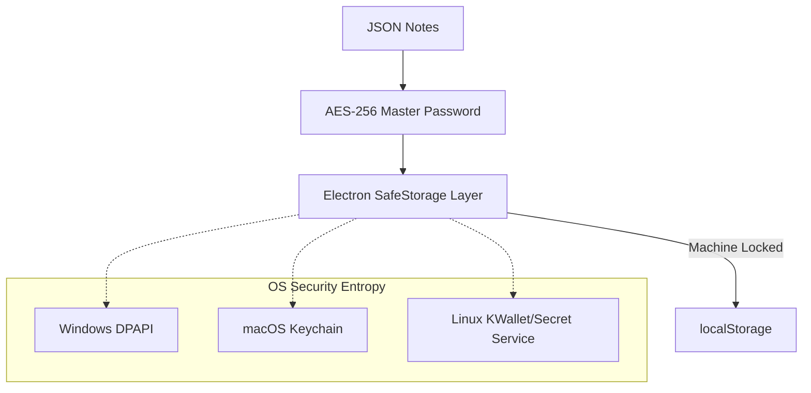
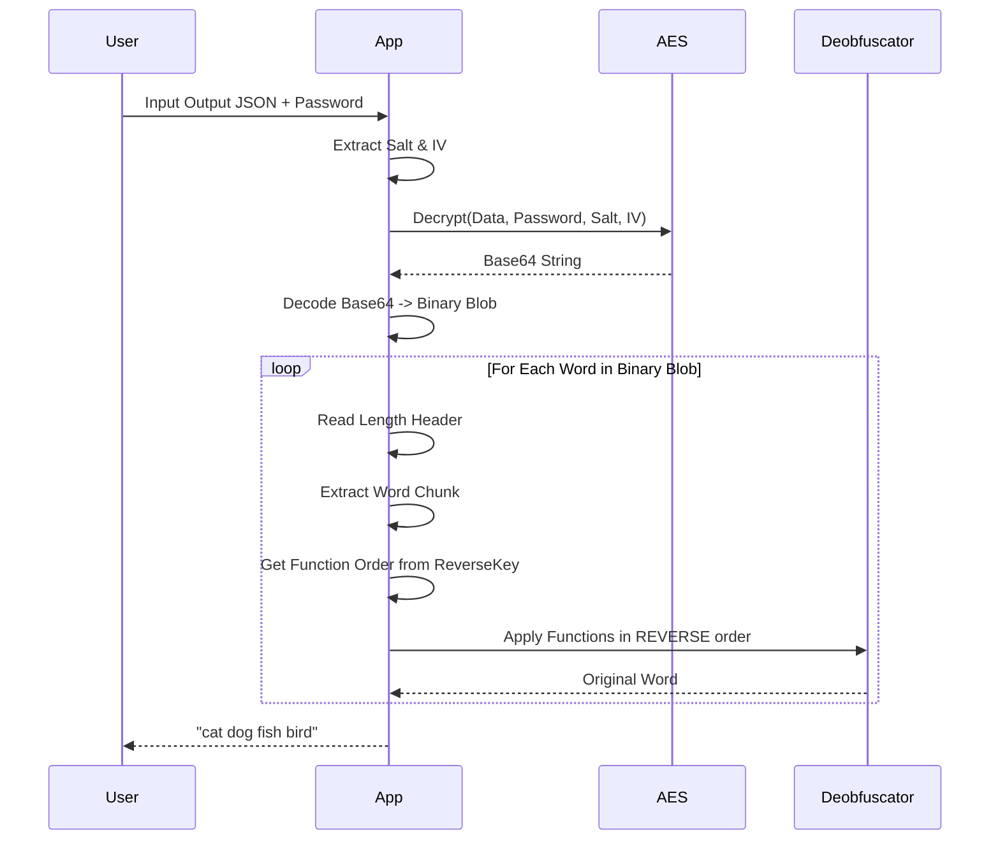

  <picture>
    <source media="(prefers-color-scheme: dark)" srcset="public/assets/img/logo-white.png">
    
  </picture>

  
  
  
  
  

  
  
  
  
  

# Darkstar V2 Encryption & P2P Architecture

This document illustrates the internal workings of the Darkstar V2 Security System. It combines **Dynamic Structural Obfuscation**, **AES-256-CBC Encryption**, and **Application Anti-Tampering** to create a comprehensive defense-grade security suite.

## 1. High-Level Workflow

The system transforms sensitive data into secure, multi-layered opaque blobs and enables anonymous communication.

---

## 2. The Core: Dynamic Obfuscation Pipeline (Mnemonic Engine)

Unlike standard encryption which applies a static algorithm, the Mnemonic Engine applies a **unique, chaotic sequence of transformations** to every single word.

### Per-Word Processing Logic

### The "Reverse Key"

Because the functions are shuffled randomly for every word, we must save the **order** in which they were applied to reverse the process tailored to that specific word.

**V2.1: Reverse Key Compression**
The reverse key is compressed using binary packing (4 bits per value), reducing the key size by ~75%.

---

## 3. V2 Memory Hardening (Uint8Array)

Darkstar implements a specialized memory hardening strategy to mitigate sensitive data residency in JavaScript's heap.

- **Strict Buffer Usage**: All encryption, decryption, and obfuscation operations now occur on `Uint8Array` rather than `string`.
- **Explicit Zeroing**: Sensitive buffers (passwords, intermediate states) are explicitly filled with zeros (`buffer.fill(0)`) immediately after their useful lifespan.
- **Async Web Crypto**: Leverages the browser's native `SubtleCrypto` for faster and more secure key derivation (PBKDF2) and AES operations.

---

## 4. Hardware-Bound Protection (Electron SafeStorage)

For Secure Vault data, Darkstar utilizes **Electron SafeStorage** to provide a final layer of protection that is bound to the user's host machine.

**Benefits:**

- **Theft Resistance**: Even if the local storage database is stolen, it cannot be decrypted on any other machine or OS user account.
- **Offline Hardening**: Renders massive cracking clusters ineffective unless they have physical access to the device's hardware-backed security entropy.

---

## 5. Secure Vault: Zero-Knowledge Architecture

The Secure Vault is designed so that the application itself has "Zero Knowledge" of the user's secrets between sessions.

- **Session State**: The Master Key and decrypted notes are stored in Angular Signals (volatile memory) and are cleared on page reload or app close.
- **Multi-Factor Persistence**:
  1. **Something You Know**: Master Password (AES-256-CBC).
  2. **Something You Have**: The specific physical machine hardware (SafeStorage).

---

## 6. Structural Steganography (Stealth Export)

This optional layer allows encrypted blobs to be hidden inside common file formats as "noise" or "metadata" to provide plausible deniability. Supported formats include `.log`, `.csv`, and `.json`.

---

## 7. Decryption Flow (Mnemonic)

---

## 8. Anti-Tamper Integrity Checks

Darkstar implements a strict application payload integrity verification check to prevent local malware or supply chain injection from silently compromising the encryption frontend.

### 8.1 Hash Generation at Build
During the compilation/packaging step, an `integrity.json` mapping is created containing the SHA-256 signatures of the Electron bundle components (e.g., `main.js`, `preload.js`).

### 8.2 Startup Verification
When Darkstar launches, before it instantiates any UI windows, the core process calculates the SHA-256 signature of its own local bundle files and compares them against the signed `integrity.json`.
- **Match:** The app continues normal execution.
- **Fail:** The app triggers an uncatchable exception, surfaces an Error Dialog to the user, and forcibly terminates its own execution, protecting the user's Secret Vault from a potentially hijacked GUI.

---

## 9. Audio Steganography (WAV LSB)

V1.10 introduces the ability to hide encrypted payloads within audio files using Least Significant Bit (LSB) steganography.

### 9.1 The Process
1.  **Payload Preparation**: The encrypted blob is prefixed with a 32-bit length header.
2.  **Carrier Generation**:
    *   **Custom Cover**: If a user uploads a `.wav` file, its PCM data is used as the carrier.
    *   **White Noise**: If no cover is provided, the system generates random 16-bit PCM noise at -20dB.
3.  **LSB Injection**: The system iterates through the PCM samples, replacing the least significant bit of each 16-bit sample with a bit from the payload.
4.  **Result**: A playable `.wav` file that sounds like the original (or static noise) but contains the hidden data.

---

## 10. Hardware & Biometric Authentication

Darkstar now supports WebAuthn for unlocking the vault, allowing for passwordless entry via:
1.  **Platform Authenticators**: Windows Hello (Face/Fingerprint), TouchID.
2.  **Cross-Platform Authenticators**: YubiKeys, Solokeys (FIDO2/U2F).

**Security Model:**
*   The **Master Password** is not replaced but *wrapped*.
*   When "Registering" biometrics, the Master Password is encrypted using `Electron SafeStorage` (OS-level key).
*   The `SafeStorage` blob is stored locally.
*   **Authentication Flow**:
    1.  User proves presence/identity via WebAuthn (Biometric/YubiKey).
    2.  If successful, the app requests `SafeStorage` to decrypt the stored Master Password blob.
    3.  The decrypted password is then used to unlock the AESVault.
*   **Safety**: This ensures that even if the local storage is dumped, the biometrically protected password cannot be retrieved without the physical device AND the user's biometric authorization.

---

## 11. Time-Lock Encryption (Verifiable Delay Functions)

Darkstar allows highly sensitive notes to be cryptographically bound by "Time". This ensures that even if an attacker successfully gains access to physical hardware and extracts a user's master password (e.g., via coercion), they still mathematically cannot decrypt specific Time-Locked notes until a specific physical duration of high constraint computation has elapsed.

### 11.1 Key Generation via Delay
Instead of deriving the note's symmetric key directly using standard entropy, the `TimeLockService` utilizes a simple continuous constraint loop:
*   A 256-bit random high-entropy `seed` is generated.
*   The `seed` is iteratively hashed in a single-threaded tight loop utilizing `CryptoJS.SHA256(previousHash)`.
*   Depending on the locked time interval (e.g. 5 minutes, 1 hour), the loop will run Millions to Billions of times (`iterations = seconds * HashFactor`).

### 11.2 Storage Constraints
The note JSON only stores the `seed` and `iterations`, not the final `key`. Upon access request, the UI must display a specialized locked state. The user must instruct the platform to begin resolving the computational hash chain in chunks back up to the exact `iteration` before the encryption key is revealed and the AES-CBC mechanism can unlock the specific payload.
