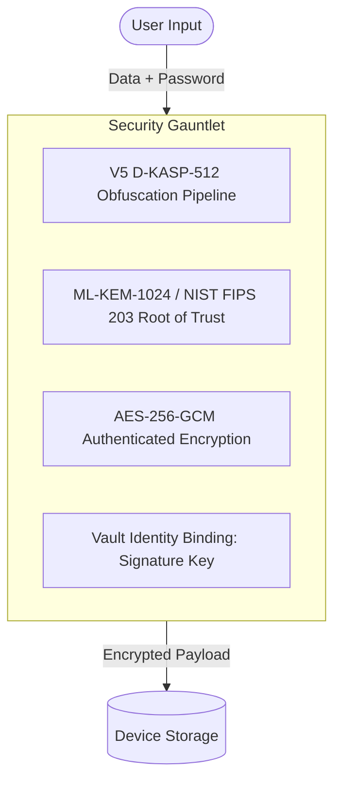
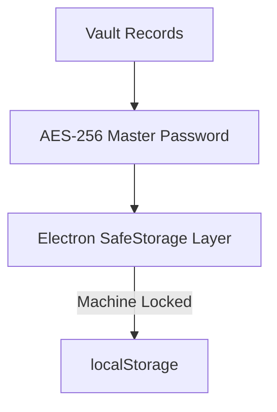

  <picture>
    <source media="(prefers-color-scheme: dark)" srcset="public/assets/img/logo-white.png">
    
  </picture>

  
  
  
  
  

  
  
  
  
  

# Darkstar V5 (D-KASP-512) Security Architecture

This document illustrates the internal workings of the Darkstar V5 Security System. It combines **D-KASP-512 High-Depth Obfuscation**, **ML-KEM-1024 Post-Quantum Key Encapsulation**, and **AES-256-GCM Authenticated Encryption**.

## 1. High-Level Workflow

The system transforms sensitive data into secure, multi-layered opaque blobs bound to a cryptographic identity.

```mermaid
graph TD
    User([User Input]) -->|Data + Password| Layers[Multi-Layer Protection]

    subgraph Layers [Security Gauntlet]
        Obf[V5 D-KASP-512 Obfuscation Pipeline]
        KEM[ML-KEM-1024 / NIST FIPS 203 Root of Trust]
        AES[AES-256-GCM Authenticated Encryption]
        Identity[Vault Identity Binding: Signature Key]
    end

    Layers -->|Encrypted Payload| Storage[(Device Storage)]
```

---

## 2. D-KASP-512: Mnemonic Engine

The Mnemonic Engine applies a unique, chaotic sequence of transformations to every word, driven by index-salted entropy.

### 2.1 The "Positional Salt" (V5 Hardened)
In the D-KASP-512 standard, the obfuscation gauntlet is driven by a seed derived from `password + word + index`. This ensures that identical words at different positions generate entirely unique cryptographic paths.

- **Depth**: Up to 512 non-linear layers (SPN/ARX).
- **Reverse Key**: A 16-bit Big-Endian packed binary string (Base64) that encodes the exact deobfuscation path tailored to the payload.

---

## 3. Cryptographic Primitives

- **ML-KEM-1024 (Kyber)**: NIST Level 5 post-quantum asymmetric key encapsulation for identity and root-of-trust.
- **AES-256-GCM**: AEAD encryption providing built-in integrity and authenticity for the high-depth blobs.
- **ChaCha20-Based PRNG**: High-performance deterministic generator for gauntlet randomization.

---

## 4. Hardware-Bound Protection

Darkstar utilizes **Electron SafeStorage** to bind the Secure Vault to the host machine's OS-level security (DPAPI, Keychain, or KWallet).

```mermaid
graph TD
    Data[Vault Records] --> AES[AES-256 Master Password]
    AES --> Safe[Electron SafeStorage Layer]
    Safe -->|Machine Locked| File[localStorage]
```

---

## 5. Security Hardening

- **Anti-Tamper Integrity**: The application hashes its own JS bundle on startup to detect malicious modifications.
- **Anti-Forensic Memory**: Strict `Uint8Array` usage with explicit zeroing. All P2P services shutdown immediately upon vault locking.
- **Time-Lock Encryption (VDF)**: Mathematically binds data to "Time" using Verifiable Delay Functions, requiring high-constraint single-threaded computation to unlock.

---

## 6. Multi-Factor Identity
Darkstar identities are bound by:
1. **Something You Know**: Master Password.
2. **Something You Have**: Machine Hardware (OS Entropy).
3. **Something You Are**: Biometric Signature (WebAuthn).
