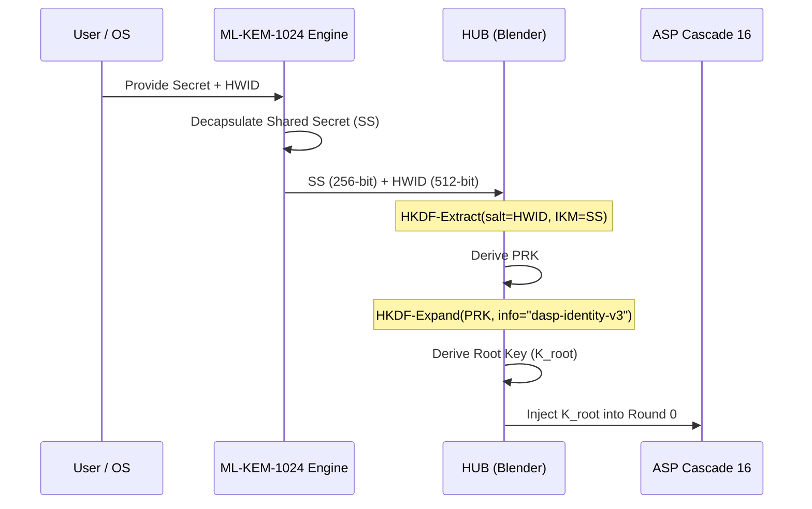
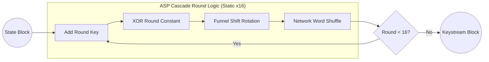
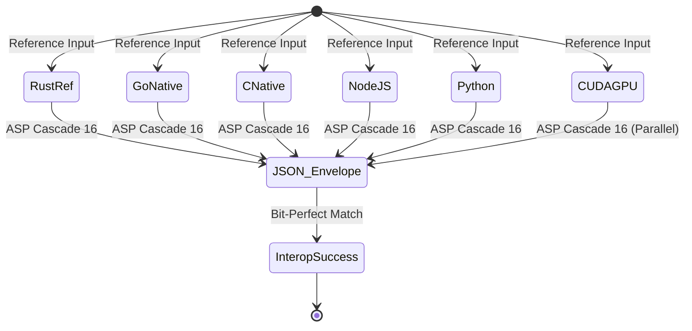

[⬅ Back to Main README](README.md)

<p align="left">
  <picture>
    <source media="(prefers-color-scheme: dark)" srcset="../public/assets/img/logo-white.png">
    
  </picture>
</p>

# ASP Cascade 16: System Logic & Architectural Flows

[**&larr; Back to D-ASP Suite**](README.md) | [**Mathematical Specification**](DASP_CRYPTO_MATH.md) | [**Project Root**](../README.md)

This document provides a high-fidelity visual breakdown of the logic flows within the **Darkstar Algebraic Substitution & Permutation (D-ASP)** protocol. It serves as the primary reference for understanding the lifecycle of a secret within the Security Enclave.

---

## 1. Global Enclave Lifecycle

The high-level flow from raw user input to secure persistent storage. The enclave ensures that every secret is cryptographically bound to the host hardware before being processed by the **ASP Cascade 16** engine.

```mermaid
graph TD
    subgraph "The Security Enclave"
    A[User Input / Secrets] --> B{Hardware-Unique Blending}
    B -- "HWID + OS Entropy" --> C[ML-KEM-1024 Root Key]
    C --> D[CTR Mode Generator]
    D -- "32-byte blocks" --> E[ASP Cascade 16 Engine (Static)]
    E -- "XOR with Payload" --> F[Encrypted Storage Enclave]
    end

    E -- "Multi-Language Interop" --> F[Rust / Go / C / Node / Python / CUDA]
```

---

## 2. Identity Binding & HUB Flow

The **Hardware-Unique Blending (HUB)** process prevents "Static State Theft" by ensuring that a shared secret ($SS$) derived from ML-KEM is only valid on the specific machine that originated the transaction.



---

## 3. The ASP Cascade 16 Loop (Static Unrolled)

The core cryptographic engine applies 16 rounds of deterministic transformation on a 256-bit (32-byte) state. It is fully unrolled into an intrinsic-forced execution model.



### Round Component Details

| Layer            | Operation               | Purpose                       |
| :--------------- | :---------------------- | :---------------------------- |
| **Addition**     | 32-bit modular addition | Destroy linear correlation    |
| **Substitution** | 32-bit bitwise XOR      | Algebraic non-linearity       |
| **Permutation**  | 32-bit Funnel Shift     | Bit-level cascading diffusion |
| **Network**      | SIMD Word Shuffle       | Cross-word diffusion          |

---

## 4. Multi-Language Interoperability Path

D-ASP achieves "Bit-Perfect" parity. Regardless of the implementation language, the output for any given input is mathematically guaranteed to be identical.



---

## 🏗️ Technical Navigation

| Scope                      | Resource                                       |
| :------------------------- | :--------------------------------------------- |
| **Formal Specification**   | [**DASP_CRYPTO_MATH.md**](DASP_CRYPTO_MATH.md) |
| **Implementation Details** | [**D-ASP README**](README.md)                  |
| **Security Guarantees**    | [**SECURITY.md**](../SECURITY.md)              |
