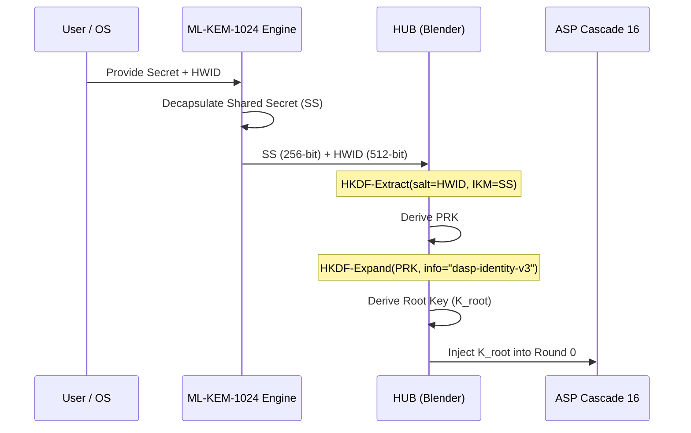
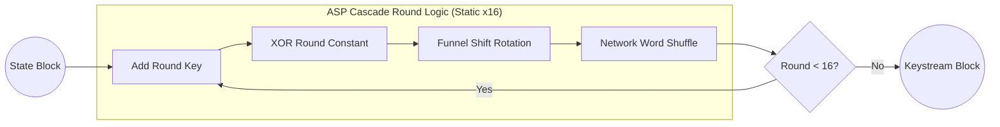
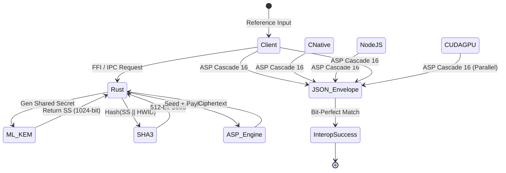

  <picture>
    <source media="(prefers-color-scheme: dark)" srcset="assets/logo-white.png">
    
  </picture>

[🏠 Main](README.md) | [📐 Math Spec](DSPNA_512_CRYPTO_MATH.md) | [⚙️ System Flows](DSPNA_512_SYSTEM_FLOW.md) | [🏛️ NIST Compliance](DSPNA_512_NIST_COMPLIANCE.md) | [💻 CLI Guide](DARKSTAR_CLI_GUIDE.md) | [🔒 Security](SECURITY.md) | [🤝 Contributing](CONTRIBUTING.md)

# ASP Cascade 16: System Logic & Architectural Flows

This document provides a high-fidelity visual breakdown of the logic flows within the **Darkstar ARX Substitution & Permutation (D-SPNA-512)** protocol. It serves as the primary reference for understanding the cryptographic execution pipeline.

## 1. Identity Binding & HUB Flow

The **Hardware-Unique Blending (HUB)** process prevents "Static State Theft" by ensuring that a shared secret ($SS$) derived from ML-KEM is only valid on the specific machine that originated the transaction.

---

## 2. The ASP Cascade 16 Loop (Static Unrolled)

The core cryptographic engine applies 16 rounds of deterministic transformation on a 256-bit (32-byte) state. It is fully unrolled into an intrinsic-forced execution model.

### Round Component Details

| Layer            | Operation               | Purpose                       |
| :--------------- | :---------------------- | :---------------------------- |
| **Permutation**  | Left/Right bitwise rotation | Structural diffusion          |
| **Network**      | Butterfly Mixing (Addition) | Cross-lane dependency         |
| **Substitution** | 32-bit bitwise XOR      | Algebraic Non-Linearity (ARX) |
| **Permutation**  | 32-bit Funnel Shift     | Bit-level cascading diffusion |
| **Network**      | SIMD Word Shuffle       | Cross-word diffusion          |

---

## 3. Multi-Language Interoperability Path

D-SPNA-512 achieves "Bit-Perfect" parity. Regardless of the implementation language, the output for any given input is mathematically guaranteed to be identical.

---

[🏠 Main](README.md) | [📐 Math Spec](DSPNA_512_CRYPTO_MATH.md) | [⚙️ System Flows](DSPNA_512_SYSTEM_FLOW.md) | [🏛️ NIST Compliance](DSPNA_512_NIST_COMPLIANCE.md) | [💻 CLI Guide](DARKSTAR_CLI_GUIDE.md) | [🔒 Security](SECURITY.md) | [🤝 Contributing](CONTRIBUTING.md)

