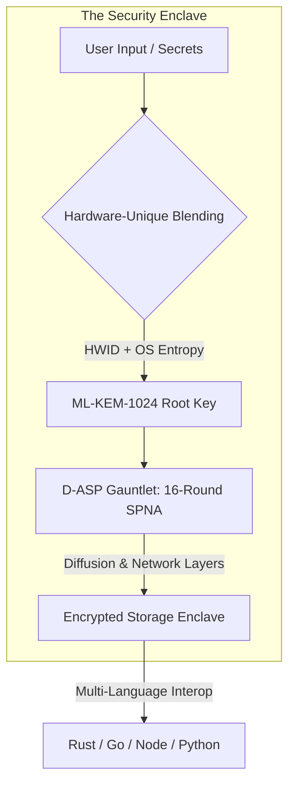

<p align="left">
  <picture>
    <source media="(prefers-color-scheme: dark)" srcset="public/assets/img/logo-white.png">
    
  </picture>
</p>

<p align="center">
  <a href="SECURITY.md"></a>
  <a href="d-asp/README.md"></a>
  
</p>

# Darkstar Security Suite
### *The Sovereign Post-Quantum Enclave for Identity & Asset Recovery.*

Darkstar is a defense-grade client-side security enclave. It provides a hardened, air-gapped-ready environment for safeguarding recovery phrases, cryptographic identities, and sensitive records using next-generation post-quantum primitives.

---

## 🏗️ System Architecture

Darkstar's security model is built on the **D-ASP (Darkstar Algebraic Substitution & Permutation)** protocol. This architecture ensures that data remains cryptographically bound to the host hardware through a multi-stage post-quantum gauntlet.



> [!NOTE]
> **Grade-1024 Compliance**: Every byte processed by Darkstar undergoes a 16-round algebraic transformation, providing maximum resistance to standard and differential cryptanalysis.

---

## 🛡️ The Multi-Engine Matrix

Darkstar provides bit-perfect interoperability across four core implementation languages. This ensures zero vendor lock-in and a verifiable, multi-language audit trail.

| Engine | optimization | implementation | Security Tier | Interop |
| :--- | :--- | :--- | :--- | :--- |
| **Rust** | **Native (LTO)** | Reference implementation | Grade-1024 | `PASSED` |
| **Go** | **Native (SSA)** | High-performance bridge | Grade-1024 | `PASSED` |
| **Node.js** | **Managed** | Production Bridge (Electron) | Grade-1024 | `PASSED` |
| **Python** | **Managed** | Research & Validation | Grade-1024 | `PASSED` |

---

## 🚀 Quick Start

Ensure you have the required runtimes (Node 19+, Rust 1.75+, Go 1.25+).

```bash
# 1. Clone the Sovereign Repository
git clone https://github.com/Kryklin/darkstar.git && cd darkstar

# 2. Deploy Local Enclave Dependencies
npm install

# 3. Synchronize Cryptographic Engines
npm run build:rust  # Reference Native
npm run build:go    # Performance Native

# 4. Initialize Dashboard
npm start
```

---

## 🏗️ Technical Resources

| Resource | Scope | Link |
| :--- | :--- | :--- |
| **D-ASP Specification** | Formal Math & Logic | [**DASP_CRYPTO_MATH.md**](d-asp/DASP_CRYPTO_MATH.md) |
| **Multi-Language Docs** | Integration & Usage | [**D-ASP Suite**](d-asp/README.md) |
| **Security Policy** | Disclosure & Auditing | [**SECURITY.md**](SECURITY.md) |
| **Contribution Guide** | Standards & Workflows | [**CONTRIBUTING.md**](CONTRIBUTING.md) |

---

## ⚖️ License

Darkstar is released under the **MIT License**. We prioritize freedom of audit and the right to sovereign encryption.
