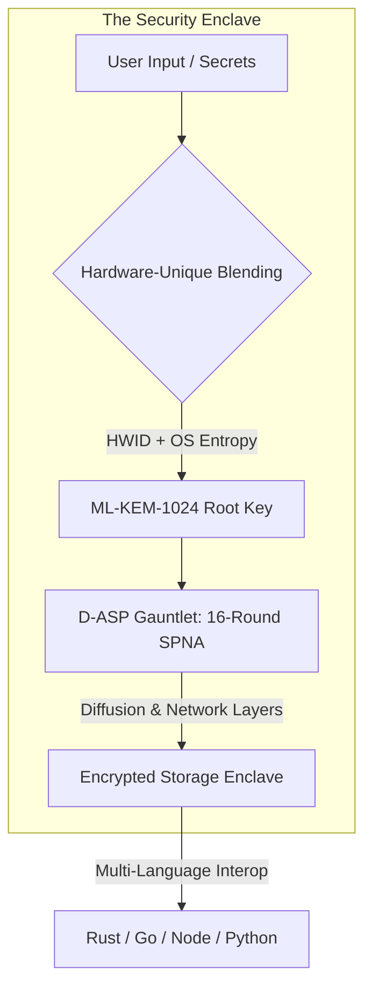
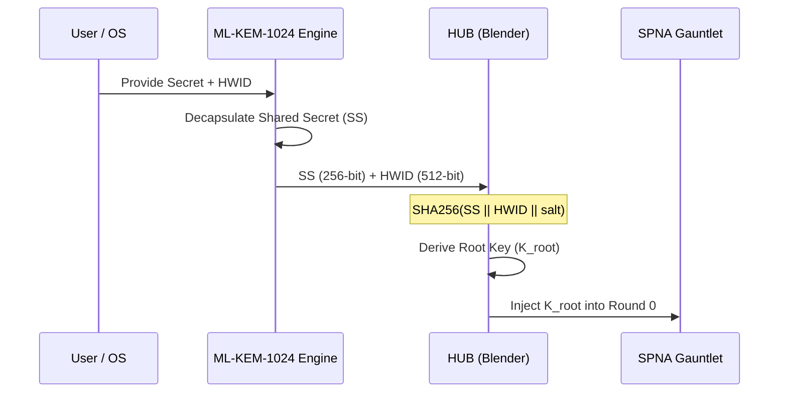
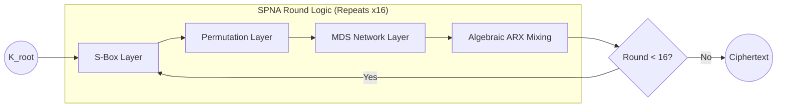
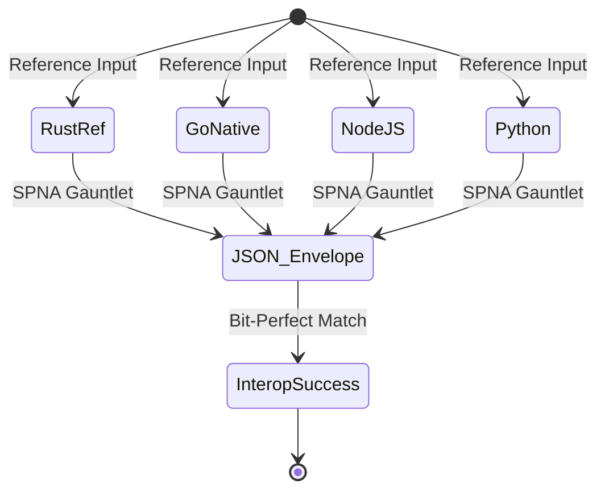

  <picture>
    <source media="(prefers-color-scheme: dark)" srcset="../public/assets/img/logo-white.png">
    
  </picture>

# D-ASP: System Logic & Architectural Flows

[**&larr; Back to D-ASP Suite**](README.md) | [**Mathematical Specification**](DASP_CRYPTO_MATH.md) | [**Project Root**](../README.md)

This document provides a high-fidelity visual breakdown of the logic flows within the **Darkstar Algebraic Substitution & Permutation (D-ASP)** protocol. It serves as the primary reference for understanding the lifecycle of a secret within the Security Enclave.

---

## 1. Global Enclave Lifecycle

The high-level flow from raw user input to secure persistent storage. The enclave ensures that every secret is cryptographically bound to the host hardware before being processed by the SPNA gauntlet.

---

## 2. Identity Binding & HUB Flow

The **Hardware-Unique Blending (HUB)** process prevents "Static State Theft" by ensuring that a shared secret ($SS$) derived from ML-KEM is only valid on the specific machine that originated the transaction.

---

## 3. The 16-Round SPNA Gauntlet

The core cryptographic engine applies 16 rounds of deterministic transformation. Each round cascades through four distinct mathematical layers to achieve maximum entropy and bit-diffusion.

### Round Component Details
| Layer | Mathematical Operation | Purpose |
| :--- | :--- | :--- |
| **Substitution** | 256-entry Non-linear S-Box | Break linear correlation |
| **Permutation** | 3-Way Columnar Transposition | Cascading diffusion |
| **Network** | MDS Matrix Multiplication (GF2^8) | Maximum Distance Separable diffusion |
| **Algebraic** | ARX (Add-Rotate-XOR) | Complexity against differential analysis |

---

## 4. Multi-Language Interoperability Path

D-ASP achieves "Bit-Perfect" parity. Regardless of the implementation language, the output for any given input is mathematically guaranteed to be identical.

---

## 🏗️ Technical Navigation

| Scope | Resource |
| :--- | :--- |
| **Formal Specification** | [**DASP_CRYPTO_MATH.md**](DASP_CRYPTO_MATH.md) |
| **Implementation Details** | [**D-ASP README**](README.md) |
| **Security Guarantees** | [**SECURITY.md**](../SECURITY.md) |
